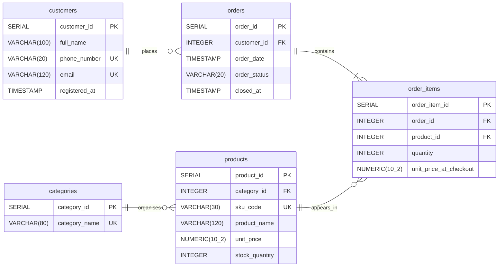

# Super Mart ER Diagram

```mermaid
erDiagram
    direction LR

    customers {
        SERIAL customer_id PK
        VARCHAR(100) full_name
        VARCHAR(20) phone_number UK
        VARCHAR(120) email UK
        TIMESTAMP registered_at
    }

    categories {
        SERIAL category_id PK
        VARCHAR(80) category_name UK
    }

    products {
        SERIAL product_id PK
        INTEGER category_id FK
        VARCHAR(30) sku_code UK
        VARCHAR(120) product_name
        NUMERIC(10_2) unit_price
        INTEGER stock_quantity
    }

    orders {
        SERIAL order_id PK
        INTEGER customer_id FK
        TIMESTAMP order_date
        VARCHAR(20) order_status
        TIMESTAMP closed_at
    }

    order_items {
        SERIAL order_item_id PK
        INTEGER order_id FK
        INTEGER product_id FK
        INTEGER quantity
        NUMERIC(10_2) unit_price_at_checkout
    }

    categories ||--o{ products : "organises"
    customers ||--o{ orders : "places"
    orders ||--|{ order_items : "contains"
    products ||--o{ order_items : "appears_in"
```